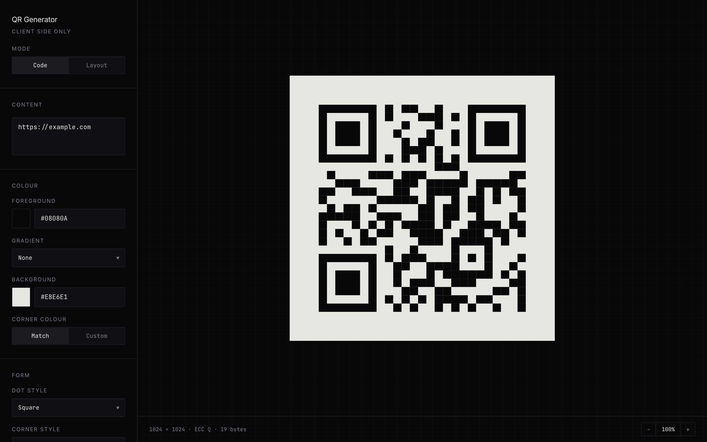
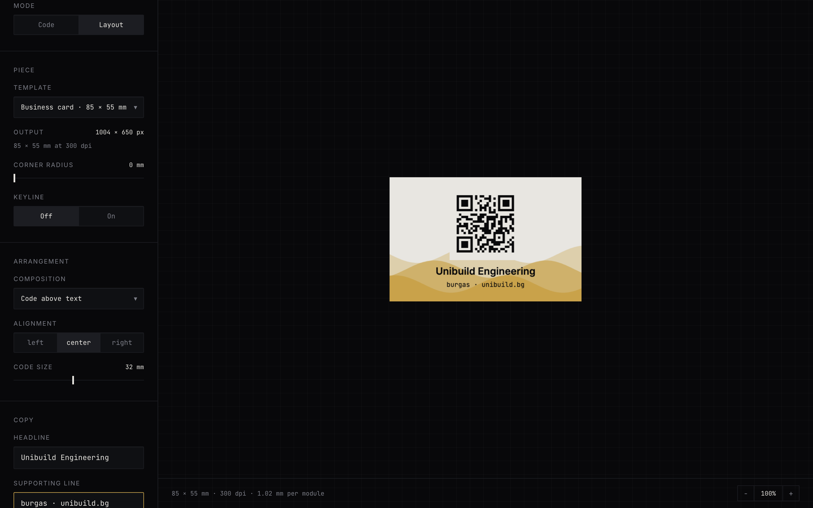

# QR Forge

A QR code generator that runs entirely in the browser and tells you when your design has stopped being scannable.

**[Live app →](https://avdyanov24.github.io/qr-forge/)**

[](https://github.com/avdyanov24/qr-forge/actions/workflows/ci.yml)
[](LICENSE)
[](https://react.dev)
[](https://vite.dev)
[](https://www.typescriptlang.org)

## Why this exists

Most QR generators will happily hand you a code that does not scan. They let you drop a logo in the middle, pick a low error-correction level, and never mention that those two choices are in direct competition for the same budget of recoverable modules. The failure is silent — the code looks fine on screen and dies on a printed flyer.

QR Forge makes that budget visible. The logo control is expressed as a share of the error-correction budget it consumes, and the app warns before you spend it all. It also checks the things that quietly break readers: insufficient contrast between foreground and background, and inverted polarity (light modules on a dark field), which a number of older scanners will not handle.

Nothing leaves the browser. There is no backend and no upload — your data and your logo never touch a network. Work is kept in local storage so a closed tab does not lose it, and that stays on your machine.

## Demo

[**Try it →**](https://avdyanov24.github.io/qr-forge/)



Layout mode, placing a finished code on a business card with a wave background. The readout gives the trim size, the export resolution and the physical module size:



## Features

- Six ready-made styles, each setting the code and the piece together, and each verified to raise no scan warnings
- Work is kept in the browser as you go, with named designs to come back to
- Live preview, debounced at 300ms
- Text or URL input of any length the format supports
- Foreground and background colour, via swatch or hex entry
- Linear or radial gradient across the modules, with an adjustable angle
- Separate colour for the three finder patterns
- Dot styles: square, dots, rounded, extra rounded, classy, classy rounded
- Corner styles and corner-centre styles: square, dot, rounded
- Square or circular frame
- Adjustable quiet zone
- Error correction levels L / M / Q / H
- Centred logo upload with a quiet zone, sized against the error-correction budget
- Output size from 256px to 2048px
- Export to PNG, SVG, JPEG or WebP at the selected size
- Scan-risk analysis: recovery-budget exhaustion, faint ink, faint finder patterns, inverted polarity, undersized quiet zone
- Stress test: decodes the code back with a real reader under eight simulated real-world conditions
- Dark and light themes, following the system preference until you choose
- Zoom from 50% to 400% on the preview, in either mode, with the field scrolling under it
- Responsive: the rail and preview stack on narrow screens, with export controls docked

### Layout mode

Places a finished code on a printable piece and exports it as PNG at 300 dpi, with the pixel dimensions a printer expects.

| Piece              | Trim         | Export         |
| ------------------ | ------------ | -------------- |
| Bookmark           | 50 × 150 mm  | 591 × 1772 px  |
| Business card (EU) | 85 × 55 mm   | 1004 × 650 px  |
| Business card (US) | 89 × 51 mm   | 1050 × 600 px  |
| Sticker            | 60 × 60 mm   | 709 × 709 px   |
| Flyer A6           | 105 × 148 mm | 1240 × 1748 px |
| Poster A5          | 148 × 210 mm | 1748 × 2480 px |

Business cards come in two standards depending on where they get printed — 85 × 55 mm (EU/ISO) and 3.5 × 2 in / 88.9 × 50.8 mm (US) — so both are here as separate templates, each keeping the size a saved design was actually built for.

Each piece takes:

- **Background patterns** — waves, contours, stripes, hexagons, dots, halftone, scatter, grid, gradient, arc, or an uploaded image, with their own colour, scale, strength and placement. Every pattern is drawn on the canvas rather than stored as a bitmap, so it stays sharp at print resolution. Placement can hold a pattern to one band, keeping it clear of the code.
- **Arrangement** — code above, below, left or right of the text; left, centre or right alignment; a code size in millimetres; and rounded corners on the code's own tile, checked against the quiet zone so the rounding cannot quietly clip a finder pattern.
- **Copy, in three tiers** — a headline, a supporting line, and a third detail line for a contact block or tagline, each independently sized (0.6× to 2× the template's own), plus an uploaded logo for the piece itself. The detail line is empty by default, so no existing design gains a line of text it never asked for.
- **A safe margin** — the inset from the trim, adjustable rather than fixed, following the same pattern as code size and text size. Print convention keeps live content 4–5 mm clear of the trim to absorb a cutter's normal tolerance; narrower is flagged, and under 2 mm is treated as a real risk of being sliced off in production.
- **Finish** — corner radius (the area outside it exports transparent, where a die cut would fall) and an optional keyline.
- **Production** — 3 mm bleed with crop marks, and an A4 imposition sheet that tiles the piece with cut guides running to the paper edge. A business card comes out 2 × 4, eight to a page.

The code has always had its own contrast checks; the words on the piece did not, so a card could pass every scan-risk check and still ship with a name nobody can read. The same 3:1 / 4.5:1 bar the code's own ink is held to now applies to the piece's ink against its background, whenever there is text on it to protect.

The code is drawn as an opaque image carrying its own background, so it always punches a clean rectangle through whatever is behind it. That is what keeps the quiet zone intact over a busy pattern.

Knowing the physical size buys a warning the pixel view cannot give you: **module size in millimetres**. A phone camera stops resolving modules below roughly 0.4 mm no matter how much error correction the code carries, and ink spread closes the gap further. The same code that sits at 1.09 mm on a bookmark drops to 0.21 mm once the URL grows and the piece shrinks to a business card — which is the failure that reaches the printer before anyone notices. Layout mode measures it from the module count the encoder actually produced and says so.

## The stress test

Every other check here is a prediction. Contrast maths, module-size arithmetic and error-correction budgets all reason about whether a code _should_ scan. The stress test is evidence: it renders the code as designed, damages it the way the physical world does, and asks the browser's own barcode reader whether it still decodes back to the same payload.

Eight conditions — a clean render, distance, defocus, ink spread on cheap paper, glare, an angled read, a scuff covering part of the code, and the re-encoding a messenger applies. A partial read counts as a failure; it has to come back as the same string.

Anything that fails lists what to change about it, most effective first — naming a failure without naming the fix leaves you stuck. The summary names the weakness rather than grading the run, because "5 of 8" says nothing on its own:

> Reads cleanly, but gives out at small sizes or across a room, when the camera is not sharp and if anything covers or scuffs it.

It discriminates rather than rubber-stamping. A short URL at level H reads under all eight. The same payload at level L loses the scuff test — precisely the condition error correction pays for. A 600-character payload also loses distance and focus.

Needs `BarcodeDetector`, which Chrome and Edge have; elsewhere the panel says so instead of guessing.

## Error correction, and what it costs

The setting the whole app revolves around, and the one most tools ask you to pick without explaining.

### It is not a backup copy

A QR code carries more than your text. The extra is **computed from** your data using Reed–Solomon coding, so a reader that recovers enough of the pattern can reconstruct the parts it could not see — closer to solving for a missing number than to keeping a spare.

One consequence surprises people: a damaged QR code is not partly readable. It either decodes completely or not at all. There is no degraded mode.

### The four levels

| Level | Recovers | Suits                              |
| ----- | -------- | ---------------------------------- |
| L     | ~7%      | Screens, clean conditions          |
| M     | ~15%     | General purpose                    |
| Q     | ~25%     | Print, or anything with a logo     |
| H     | ~30%     | Harsh conditions, stickers, labels |

That figure is the share of the code that can be lost and still decode.

### Why a scuff in one place survives

The data is not laid out in order. It is split into blocks, each block gets its own correction data, and the whole lot is **interleaved** across the grid.

So a thumb over one corner does not wipe out one block — it takes a small bite out of many, and each stays inside its own budget. Damage is deliberately smeared across the redundancy instead of concentrating in one place. This is exactly the condition the stress test flips on when you drop from H to L.

### What is not protected

The **three corner squares** carry no error correction at all. A reader uses them to locate the code before decoding begins. Wash them out and the code is not recovered with difficulty, it is never found — which is why this app ranks faint finder patterns as critical while a faint gradient end is only a caution. The quiet zone is in the same category: structural, not data.

### The cost nobody mentions

Raising the level is **not free**. More correction data means less room for your text, so the same content needs a bigger grid. At a fixed printed size, more modules means **every module is physically smaller**.

Crank a long URL to H on a business card and you have traded "survives a scratch" for "too fine for a phone to resolve" — it can genuinely scan worse than M. That trade is what the app's two measurements pull apart: **mm-per-module** catches modules too fine to resolve, and the **stress test** catches too little recovery.

The rule of thumb: **shortening the text helps twice** — bigger modules and more headroom. Raising the level helps once, and costs you module size.

## How the logo budget works

This is the part worth knowing, because it is not how most tools present it.

`qr-code-styling` does not size a logo as a fraction of the code's width. It blanks at most:

```
maxHiddenDots = imageSize × eccPercent × modules²
```

where `eccPercent` is `{ L: 0.07, M: 0.15, Q: 0.25, H: 0.30 }`. So `imageSize` is the share of the _recovery budget_ the logo consumes, and a logo can never mathematically exceed what the level can recover — at level L it is simply drawn smaller.

The real failure mode is therefore margin, not overflow. A logo that spends the entire budget still decodes from a clean render, but leaves nothing for glare, ink spread, or a creased label. The app warns above 60% of the budget and flags 85% as having no margin left. The quiet zone around the logo insets the drawn image inside the already-blanked area, so it costs no additional modules.

## Do these codes expire?

No. The code is not a link to anything — your text is physically encoded in the pattern, so scanning it is decoding, not a lookup. There is no server, no account, and no record anywhere that could be switched off. The format is a frozen standard (ISO/IEC 18004), so readers will keep reading it.

This matters more than it sounds. Many free generators produce _dynamic_ codes that encode the vendor's own short domain and redirect to your URL. Those genuinely do die — the trial lapses, the company folds, the domain expires — and every code you printed breaks at once. A code from here has no middleman in it, including this project. If this repository disappeared, every code you have already exported would keep working.

What can still break is the **destination**. A code encoding `https://yoursite.com/promo` will deliver that URL faithfully forever, including long after the page 404s. For anything printed or long-lived, encode a URL on a domain you control and redirect from there, so you can change where it goes without reprinting. Plain text, phone numbers and WiFi credentials have nothing external to rot.

The other real failure mode is physical wear — fading, scuffs, creases, glare. Error correction is the margin that absorbs it, and a logo spends exactly that margin, which is why the logo control here is measured as a share of the budget. For print, prefer level H with a small logo or none, and keep the code large. Export the SVG and keep it: it is vector, so you can re-export at any size later without regenerating.

## Tech stack

| Concern   | Choice                     |
| --------- | -------------------------- |
| UI        | React 19                   |
| Build     | Vite 8                     |
| Language  | TypeScript (strict)        |
| Styling   | Tailwind CSS 4 (CSS-first) |
| QR render | qr-code-styling 1.9        |
| Typefaces | Inter, JetBrains Mono      |

## Local setup

Requires Node 20.19+ or 22.12+.

```bash
git clone https://github.com/avdyanov24/qr-forge.git
cd qr-forge
npm install
cp .env.example .env   # optional; the app needs no variables to run
npm run dev
```

The dev server prints a local URL. Other scripts:

```bash
npm run build         # typecheck and produce dist/
npm run typecheck     # types only
npm test              # unit tests
npm run lint          # oxlint
npm run format        # prettier, in place
npm run format:check  # prettier, report only
npm run preview       # serve the built output
```

## Deployment

Pushes to `main` build and publish to GitHub Pages via `.github/workflows/deploy.yml`.

Pages serves the site from `/qr-forge/` rather than the domain root, so the workflow sets `VITE_BASE_PATH=/qr-forge/` at build time. Local development and any root-domain host need no configuration — `base` falls back to `/`. To deploy under a different path, set that variable to match.

## Project structure

```
qr-forge/
├── .github/
│   ├── ISSUE_TEMPLATE/
│   └── workflows/ci.yml
├── src/
│   ├── components/
│   │   ├── Controls.tsx    # rail primitives: fields, selects, sliders, colour, logo
│   │   ├── Preview.tsx     # QRCodeStyling instance and its lifecycle
│   │   └── ScanRisk.tsx    # annunciator panel for risk findings
│   ├── lib/
│   │   ├── qr.ts           # options builder, risk model, export
│   │   ├── patterns.ts     # canvas-drawn background patterns
│   │   ├── stress.ts       # damage conditions and the decode-back test
│   │   └── templates.ts    # print sizes, canvas render, print-risk model
│   ├── App.tsx             # layout and state
│   ├── index.css           # design tokens and component styles
│   └── main.tsx
├── index.html
├── tsconfig.json
└── vite.config.ts
```

State lives in a single `QrConfig` object in `App.tsx`. `src/lib/qr.ts` holds everything that is pure — building the render options, the risk model, and the export path — so it is testable without a DOM.

## Roadmap

- Unit tests for the risk model and export helpers
- Linting and formatting in CI
- Keyboard and screen-reader passes over the control rail
- Move rasterisation off the main thread so large exports do not block
- Batch generation from a pasted list

## License

MIT — see [LICENSE](LICENSE).
